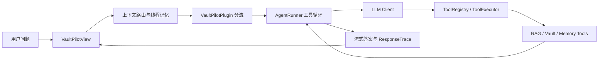

# VaultPilot

VaultPilot 是一个面向 Obsidian 的知识库 Agent 插件，用于在本地 vault 中进行自然语言问答、笔记检索、来源检查、相关笔记推荐和连续对话辅助。

这个项目的定位不是重新做一个 Obsidian，而是在 Obsidian 已有的文件、链接、命令和侧边栏能力之上，构建一个可解释、可扩展、适合学习 Agent 工程的插件。

## 核心能力

- 在 Obsidian 右侧边栏打开 Agent 对话视图。
- 检索当前 vault 中的 Markdown 笔记。
- 基于检索到的来源回答问题，并展示来源。
- 读取当前笔记并解释内容。
- 为当前笔记推荐相关 `[[wikilinks]]`。
- 支持中文、英文以及中英混合查询的基础分词。
- 支持本地检索模式，无需 API key。
- 支持 OpenAI-compatible Chat Completions 接口，可配置 DeepSeek、OpenRouter、LM Studio、本地网关等兼容服务。
- 支持工具调用模式，让模型按需读取当前笔记、搜索笔记、检查文件夹、分类文件、读写记忆。
- 支持流式输出和过程面板，展示 Agent 的处理状态与工具调用结果。
- 支持分层 Memory 系统，包括长期档案记忆、会话线程摘要、滑动窗口和跨线程回忆。

## 为什么做这个项目

VaultPilot 的目标是把 Obsidian vault 变成一个可交互的个人知识 Agent：

- Obsidian 负责笔记、文件、链接和本地工作流。
- VaultPilot 负责理解问题、调用工具、检索证据、组织上下文和生成回答。
- Memory 系统负责保存用户偏好、项目事实、历史决策和会话摘要。

它更像一个学习型 Agent 工程项目：既能作为可用插件运行，又能清楚展示 RAG、tool calling、context management、memory、evaluation 等 Agent 系统关键模块。

## 当前架构概览

主要模块：

- `src/main.ts`：插件入口，初始化设置、索引、工具、MemoryStore、ThreadStore 和 Obsidian 命令。
- `src/ui/view.ts`：右侧 Agent 视图，负责用户输入、流式输出、过程面板、当前线程和上下文拼接。
- `src/agent/`：Agent Runner、工具注册、工具执行和 tool calling 类型。
- `src/rag/`：笔记分词、索引、查询改写、检索、评估相关逻辑。
- `src/memory/`：长期记忆、会话线程、上下文路由和 memory 单元测试。
- `src/services/`：对 vault 笔记与检索服务的封装。
- `docs/`：体验升级计划、Agent 学习日志、Memory 系统设计文档等。

### 一次请求的主链路



主路径不是一次简单的“问题 → LLM → 答案”，而是：

```text
用户输入
→ 构造 conversation context
→ 判断 Memory / Local / Tool Calling / Fixed RAG 路径
→ 模型按需选择工具
→ 系统执行工具并回填 observation
→ 模型判断证据是否充分
→ 流式生成最终答案
→ 写入 thread transcript、summary 和 trace
```

`AgentRunner` 保持一个有上限的工具循环。模型在每一轮都能看到工具定义和此前的工具结果；只有当模型返回普通 assistant message 且不再请求工具时，系统才进入最终答案阶段。

## Memory 系统

VaultPilot 已实现基础的工程化 Memory 系统：

- 长期记忆：`VaultPilot/Memory.md`
  - `Preferences`
  - `Environment`
  - `Project Facts`
  - `Confirmed Decisions`
  - `Archived`
- 会话线程：`VaultPilot/Threads/<thread-id>/`
  - `metadata.json`
  - `transcript.jsonl`
  - `summary.md`
- 短期上下文：UI 内存中的 sliding window。
- 跨线程回忆：按关键词、标题命中和更新时间检索历史 thread summary。
- 记忆工具：
  - `read_profile`
  - `remember_profile`
  - `update_profile`
  - `forget_profile`
  - `read_thread_summary`
  - `search_threads`

详细设计见：

```text
docs/memory-system-design.md
```

## Agent 工具

当前工具能力包括：

- `get_current_note`：读取当前激活的 Markdown 笔记。
- `search_notes`：根据模型生成的查询检索 vault 笔记。
- `read_note`：按 vault 相对路径读取笔记。
- `inspect_folder`：基于索引检查文件夹结构和文件摘要。
- `classify_folder_files`：按语义类别统计和分类文件夹中的 Markdown 文件。
- `suggest_links`：为当前笔记推荐相关笔记链接。
- `read_profile` / `remember_profile` / `update_profile` / `forget_profile`：读写长期记忆。
- `read_thread_summary` / `search_threads`：读取当前线程摘要或搜索历史线程。

## RAG 检索与评估

VaultPilot 使用 Markdown chunk 作为检索单元，结合 BM25 关键词检索和 Ollama embedding 语义检索。生产配置采用：

```text
BM25 0.3 + Embedding 0.7
```

为避免只用少量自建笔记做主观验证，项目从 HotpotQA dev distractor split 固定抽取了 200 个多跳问题和 1979 篇候选文档，使用 gold evidence page 作为 qrels，进行 retrieval-only 消融实验。

| 检索策略 | Top-1 hit | Recall@3 | Recall@5 | All-gold Recall@5 | MRR |
| --- | ---: | ---: | ---: | ---: | ---: |
| BM25 only | 85.50% | 97.00% | 99.50% | 71.00% | 0.9110 |
| Embedding only | 92.00% | 99.50% | 99.50% | **88.50%** | **0.9550** |
| Hybrid 0.5 / 0.5 | 91.50% | 97.50% | **100.00%** | 84.50% | 0.9468 |
| Hybrid 0.3 / 0.7 | **92.00%** | **99.50%** | **100.00%** | 87.00% | 0.9538 |
| Hybrid RRF | 91.00% | 99.00% | 99.50% | 87.00% | 0.9493 |

实验结论：

- BM25 能稳定召回至少一个相关页面，但在多跳问题上更容易漏掉第二个 evidence page。
- Embedding-only 取得最高 All-gold Recall@5 和 MRR，说明该数据集更依赖语义匹配。
- Hybrid 0.3 / 0.7 相比 0.5 / 0.5 取得更高 Recall@3、All-gold Recall@5 和 MRR，因此被选为产品默认权重。
- RRF 避免直接比较 BM25 与 cosine similarity 原始分数，但在当前子集上没有超过 embedding-only 或 0.3 / 0.7 加权融合。

工程性能记录：首次构建 2066 篇笔记、2822 个 chunk 和 2822 个 embedding 耗时 722.8 秒；文档和 query embedding 命中磁盘缓存后，五组 200-query retrieval eval 总耗时约 4.8 秒。

完整实验材料：

- [RAG 评估报告](docs/rag-evaluation.md)
- [HotpotQA 官方主页](https://hotpotqa.github.io/)
- [评估脚本](scripts/run-hotpotqa-retrieval-eval.mjs)

复现实验：

```bash
npm run prepare:hotpotqa
# 在 Obsidian 中运行 Rebuild index，等待文档 embedding 构建完成
npm run eval:hotpotqa
```

运行前需要把项目放在 vault 的 `.obsidian/plugins/vaultpilot` 目录，确保 Ollama 的 `nomic-embed-text` 可用，并让 VaultPilot 为 HotpotQA corpus 构建 `.obsidian/vaultpilot/index-cache.json`。数据集、逐 query 结果和 embedding cache 是本地实验产物，不提交到插件仓库。

当前评估范围只覆盖检索质量，不把最终答案正确性、忠实度或引用准确率描述为已完成指标；RRF + rerank 仍属于后续实验。

## 失败处理与可观测性

- 单个工具失败会被包装为 `ToolExecutionResult { ok: false }`，作为 observation 回填模型，而不是直接终止整个 Agent。
- Tool Calling 主路径失败时，插件会记录 warning 并降级到固定 RAG。
- 工具循环默认最多执行 6 轮，达到上限后返回已收集的部分证据和明确 warning。
- 最终答案流式请求失败时，系统回退到上一轮模型文本，同时将失败原因写入 `ResponseTrace`。
- UI 实时展示 `step_start`、`tool_start`、`tool_result`、`step_error` 和答案增量；执行结束后展示来源、工具耗时、检索置信度和 warnings。

## 关键工程取舍

- Memory 与 RAG 证据分离：用户偏好和历史决策不能冒充 vault 笔记来源。
- Tool Calling 与具体工具解耦：LLM adapter 将供应商 `rawToolCall` 转换为内部 `ToolCall`，ToolExecutor 不依赖 OpenAI-compatible 原始协议。
- 文件优先持久化：长期记忆使用可编辑 Markdown，会话事件使用 JSONL，线程摘要使用 Markdown，符合 Obsidian 本地优先场景。
- 检索结果设置 relevance gate，`maxResults` 是候选预算，不强行展示低质量尾部来源。
- 工具决策保持非流式结构化调用，最终答案才进行 token streaming，避免伪 tool-call 标记泄漏到用户答案。

## 本地开发安装

1. 将本目录克隆或复制到 Obsidian vault 的插件目录：

   ```text
   YourVault/.obsidian/plugins/vaultpilot
   ```

2. 安装依赖：

   ```bash
   npm install
   ```

3. 构建插件：

   ```bash
   npm run build
   ```

4. 在 Obsidian 中打开社区插件，并启用 `VaultPilot`。

5. 打开命令面板，运行：

   ```text
   Open agent
   ```

## 常用命令

Obsidian 命令：

- `Open agent`：打开 VaultPilot 侧边栏。
- `Suggest links for current note`：为当前笔记推荐链接。
- `Rebuild index`：重建索引。
- `Clear index cache`：清除索引缓存。
- `Open memory`：打开长期记忆文件。
- `Open current thread summary`：打开当前会话线程摘要。
- `Start new thread`：下一次提问开启新线程，避免上下文串线。
- `Start Ollama`：尝试启动本地 Ollama。
- `Check Ollama status`：检查 Ollama 服务状态。

开发命令：

```bash
npm run build
npm run dev
npm run lint
npm test
```

## 设置说明

VaultPilot 支持多种运行方式：

- 本地检索模式：不需要 API key，使用本地索引生成基于来源的回答。
- OpenAI-compatible 模式：将检索到的笔记片段和上下文发送给兼容 Chat Completions 的模型服务。
- 本地/远程 embedding 配置：用于笔记 RAG 索引；注意当前 Memory 系统本身没有使用向量库。

默认 Chat Completions endpoint：

```text
https://api.openai.com/v1/chat/completions
```

兼容服务可以包括 DeepSeek、OpenRouter、LM Studio 或暴露相同请求格式的本地网关。

## 测试与验证

当前项目包含针对 Memory 系统的轻量测试：

```bash
npm test
```

覆盖内容包括：

- 长期记忆分区写入。
- 精确去重。
- 相似记忆更新。
- 按 query 更新。
- 归档遗忘。
- 记住/忘记指令解析。
- 新话题不注入旧上下文。
- 追问、纠正、历史回忆的上下文路由。

当前自动化测试重点覆盖 Memory 和上下文路由。AgentRunner 多步工具循环、工具失败、step limit 和 fallback trace 已完成手动验证，仍需补充独立的 mock 回归测试。

构建与 lint：

```bash
npm run build
npm run lint
```

## 当前状态

VaultPilot 已经从基础 MVP 演进为一个具备 RAG、tool calling、流式输出、过程面板和基础 Memory 系统的 Obsidian Agent 插件。

仍可继续优化的方向：

- RRF + rerank 消融实验和更强的 relevance gate。
- AgentRunner 多步工具调用与故障降级自动化测试。
- 统一 run ID 和结构化 trace 持久化。
- 面向失败样例的 RAG regression eval。
- 更精细的 token-aware context budget。
- LLM-based memory consolidation。
- 更完整的隐私删除和多用户隔离机制。
- 更成熟的 UI polish 和交互体验。
