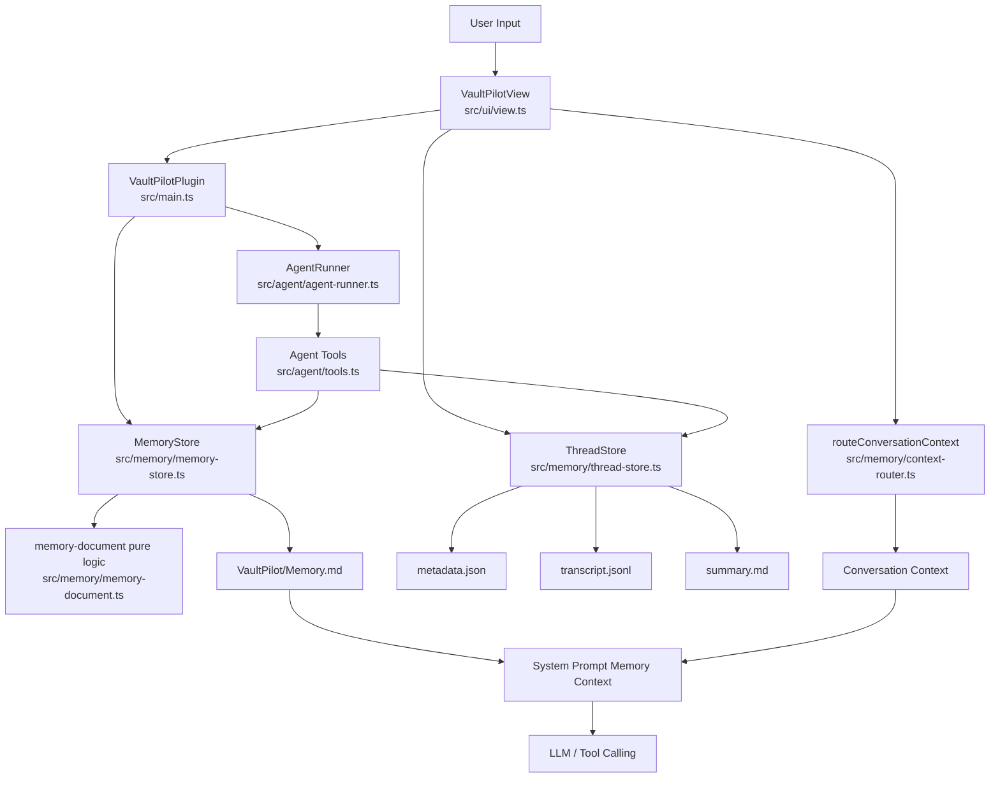
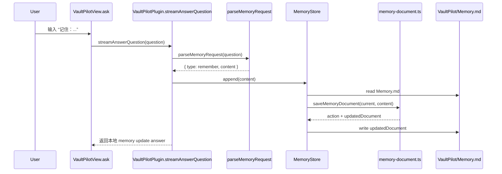
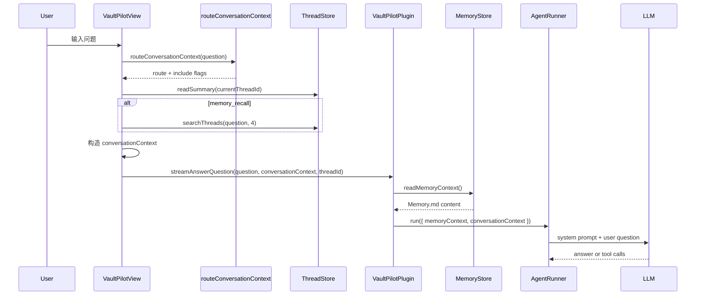

# VaultPilot Memory 系统设计文档

本文档基于当前项目代码分析，重点解释 VaultPilot 插件中的 Memory 系统设计、数据结构、写入/读取流程、Prompt 注入方式以及工程价值。本文不会把代码中不存在的模块、数据库、向量库或生产级能力描述为已实现。

## 1. Memory 系统总体介绍

VaultPilot 是一个运行在 Obsidian 中的知识库 Agent。它既要回答当前 vault 中的问题，也要在连续交互中记住用户偏好、项目决策、环境信息和历史对话上下文。Memory 系统就是为了解决“Agent 不能只看当前这句话”的问题。

### 为什么 Agent 项目需要 memory？

在普通 RAG 中，Agent 通常只检索笔记内容，然后基于检索结果回答问题。但真实的 Agent 使用场景里还存在另一类信息：

- 用户偏好：比如希望 UI 像 Codex，回答要简洁，某些操作要先规划。
- 环境信息：比如当前使用 DeepSeek API，本地 Ollama 可能没有启动。
- 项目决策：比如已决定采用分层 memory、thread summary、sliding window。
- 当前会话状态：比如上一轮问了什么、工具调用结果是什么、当前任务推进到哪里。
- 历史会话摘要：比如很早之前讨论过的方案、结论和开放问题。

这些信息不一定存在于用户的普通笔记里，也不适合每次都靠笔记检索获得。因此项目实现了一套独立于 RAG 笔记索引的 Memory 系统。

### 这个 memory 记录哪些信息？

当前代码中主要有三类 memory：

1. 长期用户/项目档案记忆  
   存储在 `VaultPilot/Memory.md`，由 [src/memory/memory-store.ts](../src/memory/memory-store.ts) 和 [src/memory/memory-document.ts](../src/memory/memory-document.ts) 管理。

2. 会话线程记忆  
   存储在 `VaultPilot/Threads/<thread-id>/`，由 [src/memory/thread-store.ts](../src/memory/thread-store.ts) 管理，包括 `metadata.json`、`transcript.jsonl` 和 `summary.md`。

3. UI 内存中的短期滑动窗口  
   存储在 `VaultPilotView.conversationTurns`，位于 [src/ui/view.ts](../src/ui/view.ts)，只保留最近若干轮，用于 follow-up 问题的上下文补全。

### memory 和普通数据库存储有什么区别？

当前项目没有使用数据库、ORM、migration 或外部向量数据库。Memory 采用 Obsidian vault 内的文件作为存储：

- `Memory.md` 是用户可读、可编辑的 Markdown 档案卡。
- `transcript.jsonl` 是按行追加的事件日志。
- `summary.md` 是可读的线程摘要。
- `metadata.json` 保存线程元数据。

这更像“面向 Agent 的可编辑上下文层”，而不是传统业务数据库。它的目标不是做复杂查询事务，而是让 Agent 能以低成本、可解释的方式获取用户偏好、历史上下文和执行轨迹。

### memory 在交互、任务执行和上下文管理中的作用

- 用户交互：用户可以通过“记住/忘记”等指令直接写入长期记忆，入口在 `VaultPilotPlugin.answerQuestion()` 和 `VaultPilotPlugin.streamAnswerQuestion()` 中调用 `parseMemoryRequest()`。
- 任务执行：Agent 工具层提供 `read_profile`、`remember_profile`、`update_profile`、`forget_profile`、`read_thread_summary`、`search_threads` 等 memory tools，定义在 [src/agent/tools.ts](../src/agent/tools.ts)。
- 上下文管理：`VaultPilotView.buildConversationContext()` 根据 `routeConversationContext()` 的结果决定是否注入线程摘要、滑动窗口和历史线程候选。
- Prompt 注入：`AgentRunner.buildSystemPrompt()` 把长期 memory 和 conversation context 注入 system prompt。

## 2. 整体架构图与模块划分

整体架构可以理解为四层：

1. 存储层：Obsidian vault 文件系统。
2. Memory 逻辑层：处理 Markdown memory 文档、线程日志、线程摘要、搜索。
3. Agent 接入层：把 memory 作为 tool 和 prompt context 暴露给模型。
4. UI/交互层：捕获用户输入、流式事件、工具事件，维护当前线程和滑动窗口。



### 核心模块职责

| 模块 | 路径 | 职责 |
|---|---|---|
| `MemoryStore` | `src/memory/memory-store.ts` | Obsidian 文件适配层，负责读写 `VaultPilot/Memory.md` |
| `memory-document` | `src/memory/memory-document.ts` | 长期记忆文档的纯逻辑：规范化、保存、更新、遗忘、去重、解析指令 |
| `ThreadStore` | `src/memory/thread-store.ts` | 创建线程、追加事件、更新摘要、搜索历史线程 |
| `context-router` | `src/memory/context-router.ts` | 判断用户问题属于新话题、追问、回忆还是纠正，决定上下文注入策略 |
| `Agent tools` | `src/agent/tools.ts` | 把 memory 能力包装成模型可调用工具 |
| `AgentRunner` | `src/agent/agent-runner.ts` | 构建 system prompt，说明 memory 使用规则，并执行 tool calling |
| `VaultPilotView` | `src/ui/view.ts` | 维护当前线程、滑动窗口、收集工具/过程事件，构造 conversation context |
| `VaultPilotPlugin` | `src/main.ts` | 初始化 store/tools，处理直接记忆指令，连接 UI 与 Agent |

### 哪些模块写入 memory？

- `MemoryStore.append()`、`MemoryStore.update()`、`MemoryStore.forget()` 写入 `VaultPilot/Memory.md`。
- `ThreadStore.createThread()` 创建线程目录和初始文件。
- `ThreadStore.appendEvent()` 写入 `transcript.jsonl`。
- `ThreadStore.updateSummary()` 写入 `summary.md`。
- `VaultPilotView.ask()` 在用户消息、process、tool_start、tool_result、assistant answer 等事件发生时调用 `threadStore.appendEvent()`。

### 哪些模块读取 memory？

- `VaultPilotPlugin.readMemoryContext()` 每次 Agent 回答前读取长期 memory。
- `VaultPilotView.buildConversationContext()` 读取当前线程 summary、滑动窗口，必要时搜索历史线程。
- Agent tools 中的 `read_profile`、`read_thread_summary`、`search_threads` 会读取 memory。
- 命令 `Open memory` 和 `Open current thread summary` 会打开对应文件。

### 哪些模块筛选、压缩、总结或检索 memory？

- `memory-document.ts`：对长期 memory 做去重、相似更新、scope 分类。
- `thread-store.ts`：对 transcript 生成 rolling summary；对历史线程按关键词、标题命中和 recency boost 检索。
- `context-router.ts`：决定当前问题是否需要线程摘要、滑动窗口或历史线程候选。
- `VaultPilotView.buildConversationContext()`：对滑动窗口截断到约 4000 字符，对最终 context 截断到约 7000 字符。

## 3. 数据结构与存储设计

### 3.1 长期 Profile Memory：`VaultPilot/Memory.md`

长期 memory 存储在 Markdown 文件中，默认结构定义在 `src/memory/memory-store.ts` 的 `DEFAULT_MEMORY`：

```markdown
# VaultPilot Memory

## Preferences

## Environment

## Project Facts

## Confirmed Decisions

## Archived
```

每条 memory 使用固定 Markdown block 格式，由 `memory-document.ts` 中 `formatMemoryEntry()` 生成，并由 `MEMORY_ENTRY_PATTERN` 解析。

| 字段 | 类型 | 含义 | 是否实现 |
|---|---|---|---|
| `id` | string | memory 唯一 id，格式为 `mem-${timestamp}-${random}` | 是 |
| `status` | `active` / `archived` | 当前有效或已归档 | 是 |
| `scope` | `preference` / `environment` / `project` / `decision` / `vaultpilot-ui` | 记忆分类 | 是 |
| `updated` | `YYYY-MM-DD` | 最近更新时间 | 是 |
| `archived` | `YYYY-MM-DD` | 被遗忘/归档时间，仅 archived memory 有 | 是 |
| `content` | string | 记忆正文 | 是 |
| `user_id` | - | 多用户 id | 未实现 |
| `session_id` | - | 长期 profile memory 不记录 session id | 未实现 |
| `embedding` | - | 向量表示 | 未实现 |
| `score` | - | 检索得分，长期 profile memory 不保存 | 未实现 |

### 3.2 会话线程 Memory：`VaultPilot/Threads/<thread-id>/`

线程 memory 由 `ThreadStore` 管理。每个线程目录包含：

| 文件 | 写入位置 | 内容 |
|---|---|---|
| `metadata.json` | `ThreadStore.createThread()` / `updateMetadata()` | 线程 id、标题、创建/更新时间、状态、事件数 |
| `transcript.jsonl` | `ThreadStore.writeEvent()` | 用户、助手、过程、工具事件的 JSONL 日志 |
| `summary.md` | `ThreadStore.createThread()` / `writeSummary()` | 可读滚动摘要 |

`ThreadMetadata` 在 `src/memory/thread-store.ts` 中定义：

| 字段 | 类型 | 含义 |
|---|---|---|
| `id` | string | 线程 id，格式为 `YYYYMMDD-HHMMSS-random` |
| `title` | string | 从初始问题截断得到的标题 |
| `createdAt` | ISO string | 创建时间 |
| `updatedAt` | ISO string | 最后事件时间 |
| `status` | `active` / `archived` | 当前仅创建 active，搜索会跳过 archived |
| `eventCount` | number | 追加事件数量 |

`ThreadEvent` 类型包括：

| type | 字段 | 含义 |
|---|---|---|
| `user` | `content` | 用户输入 |
| `assistant` | `content` | 最终助手回答 |
| `process` | `content` | 模型过程说明 |
| `tool_start` | `name`, `inputSummary` | 工具开始调用 |
| `tool_result` | `name`, `ok`, `summary`, `durationMs`, `error?` | 工具执行结果 |

`ThreadSearchResult` 用于跨线程检索：

| 字段 | 含义 |
|---|---|
| `id` | 线程 id |
| `title` | 线程标题 |
| `createdAt` / `updatedAt` | 创建和更新时间 |
| `eventCount` | 事件数量 |
| `score` | 规则检索得分 |
| `matches` | 命中的 query token |
| `excerpt` | 从 summary 中截取的命中片段 |

### 3.3 是否使用数据库、ORM、migration？

当前项目未发现数据库、ORM、schema migration。Memory 数据都存储在 Obsidian vault 文件中。

### 3.4 是否使用向量检索？

Memory 系统本身未使用向量检索，也没有保存 memory embedding。项目中存在笔记 RAG/embedding 索引，例如 `IndexManager` 和 `search_notes` 工具，但它们属于 vault 笔记检索，不是 memory 存储层。

跨线程检索 `ThreadStore.searchThreads()` 是规则检索：tokenize query，然后在 thread title + summary 中做字符串命中，得分由命中数、标题命中和时间 recency boost 组成。

## 4. Memory 写入流程

Memory 写入有两条主路径：

1. 用户直接说“记住/忘记”，由插件入口拦截并写入长期 memory。
2. Agent tool calling 中模型显式调用 memory tools。

### 4.1 直接记忆指令写入流程

调用链：

1. `VaultPilotView.ask()` 收到用户输入。
2. `VaultPilotPlugin.streamAnswerQuestion()` 或 `answerQuestion()` 调用 `parseMemoryRequest(question)`。
3. 如果命中 `remember` 或 `forget`，进入 `handleMemoryRequest()`，不再走普通 RAG/Agent 回答。
4. `remember` 调用 `MemoryStore.append()`。
5. `MemoryStore.append()` 读取 `Memory.md`，调用 `saveMemoryDocument()`。
6. `saveMemoryDocument()` 进行 scope 推断、去重、相似更新或创建新条目。
7. `MemoryStore` 将 `updatedDocument` 写回 `VaultPilot/Memory.md`。



### 4.2 Agent tool 写入流程

如果普通对话进入 tool calling，模型可以调用 `remember_profile`、`update_profile`、`forget_profile`。

相关代码：

- tools 定义：`src/agent/tools.ts`
- 工具执行上下文：`ToolContext` 中包含 `memory: MemoryStore` 和 `threads: ThreadStore`
- runner prompt 规则：`AgentRunner.buildSystemPrompt()`

写入工具：

| Tool | 函数/对象 | 行为 |
|---|---|---|
| `remember_profile` | `rememberProfileTool` | 调用 `context.memory.append(content)` |
| `update_profile` | `updateProfileTool` | 调用 `context.memory.update(query, content)` |
| `forget_profile` | `forgetProfileTool` | 调用 `context.memory.forget(query)` |

### 4.3 去重、合并、更新

长期 memory 的核心逻辑在 `src/memory/memory-document.ts`：

- `saveMemoryDocument()`：
  - 清理空内容；
  - `inferMemoryScope()` 推断 scope；
  - `findReusableMemory()` 在同 scope active entries 中查找可复用条目；
  - exact match 返回 `action: 'unchanged'`；
  - 相似度达到阈值则更新旧 entry，返回 `action: 'updated'`；
  - 否则创建新 entry。

- `similarityScore()`：
  - 先将中英文内容 token 化；
  - 使用 Jaccard 和 containment 两种得分的较大值；
  - `findReusableMemory()` 当前阈值是 `0.72`。

- `updateMemoryDocument()`：
  - `findBestMemoryMatch()` 支持直接包含匹配和相似度匹配；
  - 当前相似匹配阈值是 `0.45`。

### 4.4 线程 memory 写入流程

每次 `VaultPilotView.ask()` 会：

- `ensureThread()` 创建或复用当前 thread。
- 立即 `appendEvent({ type: 'user' })`。
- 收到 process/tool_start/tool_result 事件时追加对应事件。
- 最终回答后追加 `assistant` 事件。
- 调用 `threadStore.updateSummary(threadId)` 生成滚动摘要。

失败处理：

- `ThreadStore.appendEvent()` 和 `updateSummary()` 使用 per-thread Promise queue，并在 catch 中 `console.debug()`，避免单次写入失败打断 UI 主流程。
- `MemoryStore.readMemoryContext()` 失败时返回空字符串并 `console.debug()`。

## 5. Memory 读取与检索流程

### 是否每次对话都会读取 memory？

在远程模型/Agent 回答路径中，长期 profile memory 基本会被读取：

- tool calling 路径：`VaultPilotPlugin.answerQuestionWithTools()` 调用 `readMemoryContext()`，传入 `AgentRunner.run({ memoryContext })`。
- 非 tool 的远程模型路径：`callRemoteModel()` / `callRemoteModelStream()` 也接收 `await this.readMemoryContext()`。

local provider 路径主要走本地检索回答，当前没有把长期 memory 注入 local answer。

### 是否根据用户问题检索相关 memory？

长期 `Memory.md` 当前不是按 query 做局部检索，而是整体读取后注入 prompt。筛选主要发生在写入阶段和上下文路由阶段。

历史线程 memory 有检索：

- `ThreadStore.searchThreads(query, limit = 5)`：
  - query tokenize；
  - 遍历 `VaultPilot/Threads` 下的线程目录；
  - 读取 metadata 和 summary；
  - title + summary 字符串命中；
  - 按 score 和 updatedAt 排序；
  - limit 通过 `clampLimit()` 限制到 1-12。

### 检索依据是什么？

| 类型 | 检索方式 |
|---|---|
| 长期 profile memory | 当前整体读取，无 top-k |
| 当前线程 summary | 根据当前 threadId 直接读取 |
| 滑动窗口 | 取 `conversationTurns.slice(-6)` |
| 历史线程 | 关键词命中 + 标题命中 + recency boost |
| Vault 笔记 RAG | 使用项目已有 `IndexManager` / `search_notes`，不是 memory 本身 |

`ThreadStore.scoreThread()` 得分：

- `matches.length * 10`
- `titleHits * 6`
- `calculateRecencyBoost(updatedAt)`，1 天内 +4，7 天内 +2，30 天内 +1

没有 rerank 模型，没有 embedding 相似度，没有 metadata filter（除了跳过 archived thread），没有用户隔离。

### 读取流程图



### memory 如何影响最终回复？

Memory 不直接“生成答案”，而是通过三种方式影响回复：

1. 作为 system prompt 的背景信息，帮助模型理解用户偏好和项目上下文。
2. 作为 tool，可由模型主动读取或修改。
3. 作为 conversation context，帮助模型理解追问、纠正和历史回忆。

`AgentRunner.buildSystemPrompt()` 明确要求：memory 是用户可编辑偏好和项目上下文，不是 vault evidence；回答 vault 事实问题时仍应基于 vault tool evidence。

## 6. Memory 与 Prompt / Context 的关系

### 注入位置

Memory 注入到 `AgentRunner.buildSystemPrompt()` 构造的 system prompt 中：

- `formatMemoryContext(memoryContext)`：注入长期 `Memory.md`。
- `formatConversationContext(conversationContext)`：注入当前线程 summary、滑动窗口、历史线程候选。

它不是 developer prompt，也不是单独 user message，而是 system prompt 的一部分。

### 格式

`formatMemoryContext()` 格式大致为：

```text
Saved VaultPilot memory follows. Treat it as user-editable preferences and project context, not vault evidence.

# VaultPilot Memory

## Preferences
- id: mem-...
  status: active
  scope: preference
  updated: 2026-06-11
  content: ...
```

`formatConversationContext()` 格式大致为：

```text
Recent conversation context follows. Use it to resolve pronouns, follow-up questions, and user intent. It is not vault evidence.

Context route: follow_up
Context route reason: The question uses follow-up references without a clear standalone topic.

Thread summary:
# ...

Recent conversation window:
Turn 1
User: ...
Assistant: ...
```

### token / 长度限制

当前没有 token 级 tokenizer，也没有按模型上下文窗口精确预算。采用字符串截断：

- `VaultPilotView.buildConversationContext()` 中 sliding window：`.slice(-4000)`。
- 最终 conversationContext：`.slice(-7000)`。
- profile memory 当前整体注入，没有 top-k 或长度截断。

### memory 太多时如何处理？

已实现：

- 线程 summary 压缩 transcript。
- follow-up 才注入滑动窗口。
- `new_topic` 不注入当前线程 summary 和 sliding window，减少上下文污染。
- `memory_recall` 才搜索历史线程候选。
- 历史线程搜索有 `limit`，UI 注入时使用 `searchThreads(question, 4)`。

未实现：

- 长期 profile memory top-k 检索。
- 基于 embedding 的 memory retrieval。
- LLM-based memory consolidation。
- token-aware truncation。

## 7. Memory 的更新、删除与过期机制

### 更新

已实现：

- `MemoryStore.update(query, content)` 调用 `updateMemoryDocument()`。
- Agent tool `update_profile` 调用 `context.memory.update(query, content)`。
- 直接 `remember` 写入时，`saveMemoryDocument()` 会进行 exact 去重和相似更新。

### 遗忘 / 删除

项目实现的是“归档式遗忘”，不是物理删除：

- `MemoryStore.forget(query)` 调用 `forgetMemoryDocument()`。
- 匹配 active memory 的 `content` 子串后，将 `status: active` 改为 `status: archived`，并增加 `archived: YYYY-MM-DD`。
- 原始 `content` 仍保留在 `Memory.md` 中。

因此如果面试中被问到隐私删除，需要明确：当前实现是软删除/归档，不是合规意义上的物理删除。

### 过期机制

当前未发现自动过期 TTL、重要性评分、自动删除或自动衰减机制。

### 合并相似 memory

已实现初步相似合并：

- `findReusableMemory()` 只在同 scope 的 active entries 中查找。
- `similarityScore()` 使用 token Jaccard 和 containment。
- 达到阈值会复用旧 id，并替换旧内容。

### 用户隐私与安全

当前没有多用户隔离、加密、权限分层或隐私审计。Memory 文件存储在本地 Obsidian vault 中，依赖本地文件系统与 Obsidian vault 的访问边界。

## 8. 关键代码精读

### 8.1 `src/memory/memory-document.ts`

主要职责：长期 profile memory 的纯逻辑层。

核心函数：

- `normalizeMemoryDocument(content)`
- `saveMemoryDocument(source, content, now, idFactory)`
- `updateMemoryDocument(source, query, content, now)`
- `forgetMemoryDocument(source, query, now)`
- `parseMemoryRequest(question)`

输入：

- Markdown 文档字符串；
- 用户要保存/更新/遗忘的内容；
- 可选时间和 idFactory，用于测试。

输出：

- `MemorySaveResult`，包含 `action`、`id`、`scope`、`content`、`updatedDocument`。
- `MemoryForgetResult`，包含 `count` 和 `updatedDocument`。

关键逻辑：

- `MEMORY_ENTRY_PATTERN` 用正则解析 Markdown entry。
- `inferMemoryScope()` 根据关键词推断 `preference/environment/project/decision/vaultpilot-ui`。
- `findReusableMemory()` 先 exact match，再相似度匹配。
- `similarityScore()` 同时考虑 Jaccard 和 containment，支持“新记忆是旧记忆扩写”的场景。

学习重点：

- 如何把 Agent memory 的核心逻辑做成纯函数，方便测试和迁移。
- 如何用轻量规则实现基础 memory dedup/update。

### 8.2 `src/memory/memory-store.ts`

主要职责：Obsidian vault 文件适配层。

核心类：`MemoryStore`

核心方法：

- `read()`
- `append(content)`
- `update(query, content)`
- `forget(query)`

输入：

- 用户或 tool 提供的 memory 内容。

输出：

- 读取时输出 Markdown 字符串；
- 写入时输出 `MemorySaveResult | null` 或归档数量。

关键逻辑：

- `ensureFile()` 确保 `VaultPilot/Memory.md` 存在。
- `read()` 会 normalize 文档结构。
- `append/update/forget` 调用 `memory-document.ts` 纯逻辑，并把 `updatedDocument` 写回文件。

学习重点：

- 文件 IO 和业务逻辑分层。
- Obsidian 插件中如何通过 `vault.adapter` 管理本地文件。

### 8.3 `src/memory/thread-store.ts`

主要职责：会话线程记忆管理。

核心类：`ThreadStore`

核心方法：

- `createThread(initialTitle)`
- `appendEvent(threadId, event)`
- `updateSummary(threadId)`
- `readSummary(threadId)`
- `searchThreads(query, limit)`

输入：

- 用户问题、助手回答、过程事件、工具事件。

输出：

- 线程目录；
- JSONL transcript；
- Markdown summary；
- `ThreadSearchResult[]`。

关键逻辑：

- `appendEvent()` 使用 `queues` Map 保证同一 thread 的写入串行化。
- `writeSummary()` 从 transcript 生成 rolling summary。
- `buildRollingSummary()` 提取 Current Topic、Recent User Goals、Decisions、Tool Activity、Recent Turns、Open Questions。
- `searchThreads()` 遍历线程目录，按 token match + title hits + recency boost 排序。

学习重点：

- Agent 运行过程如何转化为可读、可检索的执行记忆。
- JSONL 日志 + Markdown summary 的组合设计。

### 8.4 `src/memory/context-router.ts`

主要职责：判断当前问题该使用哪种上下文策略。

核心函数：`routeConversationContext(question)`

输出：

```ts
{
  route: 'follow_up' | 'new_topic' | 'memory_recall' | 'correction',
  includeSummary: boolean,
  includeSlidingWindow: boolean,
  includePastThreads: boolean
}
```

关键逻辑：

- correction：带当前 summary + sliding window，不搜索旧线程。
- memory_recall：带当前 summary + sliding window + past threads。
- follow_up：带当前 summary + sliding window。
- new_topic：不带 summary，不带 sliding window，不带 past threads。

学习重点：

- 如何避免 Agent 连续对话中的上下文污染。
- 如何用规则路由实现初步 context management。

### 8.5 `src/agent/tools.ts`

主要职责：把 memory 能力暴露为 tool calling 接口。

memory tools：

- `read_profile`
- `remember_profile`
- `forget_profile`
- `update_profile`
- `read_thread_summary`
- `search_threads`

输入：

- tool schema 中定义的 JSON 参数。

输出：

- profile 内容、保存结果、归档数量、线程摘要或线程搜索结果。

关键逻辑：

- 写工具的 `risk` 标记为 `write`。
- `update_profile` 找不到匹配时返回 `{ updated: false, message }`。
- `search_threads` 调用 `context.threads.searchThreads(query, limit)`。

学习重点：

- Memory 不只是 prompt 注入，也可以成为 Agent 主动调用的工具。

### 8.6 `src/ui/view.ts` 与 `src/main.ts`

主要职责：交互入口和上下文组装。

关键函数：

- `VaultPilotView.ask(question)`
- `VaultPilotView.buildConversationContext(threadId, question)`
- `VaultPilotPlugin.answerQuestion()`
- `VaultPilotPlugin.streamAnswerQuestion()`
- `VaultPilotPlugin.answerQuestionWithTools()`
- `VaultPilotPlugin.handleMemoryRequest()`

关键逻辑：

- `ask()` 维护 current thread，并记录 user/process/tool/assistant 事件。
- `buildConversationContext()` 根据 context router 决定注入哪些上下文。
- `handleMemoryRequest()` 对显式 remember/forget 指令走本地 memory update，不进入普通回答链路。
- `answerQuestionWithTools()` 将 `memoryStore`、`threadStore`、`currentThreadId` 注入 `ToolContext`。

学习重点：

- Memory 系统不是独立模块，而是贯穿 UI、Agent Runner、Tool Executor 和 prompt 构造的上下文基础设施。

## 9. 设计亮点与工程价值

### 已实现的亮点

- 支持长期记忆：通过 `VaultPilot/Memory.md` 保存用户偏好、环境、项目事实和决策。
- 支持会话记忆：每个 thread 有 transcript 和 rolling summary。
- 支持跨线程召回：`searchThreads()` 可检索历史 thread summary。
- 支持上下文压缩：使用 summary + sliding window，而不是无限塞完整历史。
- 支持上下文路由：新话题、追问、回忆、纠正采用不同注入策略。
- 支持 memory-as-tools：模型可以主动读写 memory，而不仅是被动 prompt 注入。
- 支持去重和更新：同 scope 相似 memory 会更新旧条目。
- 模块解耦：`memory-document.ts` 是纯逻辑，`MemoryStore` 是文件适配层。
- 有回归测试：`npm test` 覆盖 memory document 和 context router。

### 未实现或仅初步实现

- 未实现 memory embedding / vector search。
- 未实现多用户隔离。
- 未实现物理删除或隐私合规删除。
- 未实现 LLM-based memory consolidation。
- 未实现 token-aware prompt budget。
- 未实现重要性评分和自动过期。

### 简历可用工程价值描述

这个系统体现的是 Agent 工程中的 Context Management 能力：不只是简单保存聊天记录，而是把记忆拆成长期档案、线程日志、滚动摘要、滑动窗口和工具化访问，并通过路由策略控制何时注入上下文，从而降低上下文污染并提升连续任务能力。

## 10. 可以写进简历的表达

### 简洁版

- 设计并实现 Obsidian Agent 的分层 Memory 系统，支持长期用户档案、会话线程摘要、跨线程召回、记忆去重更新和上下文路由，提升 Agent 连续对话与个性化能力。

### 技术版

- 在 VaultPilot Agent 中实现文件型 Memory 架构：基于 Markdown/JSONL 存储长期 profile memory 与 thread memory，提供 `read/remember/update/forget/search_threads` 等 Agent tools；通过 context router 区分 new topic、follow-up、memory recall、correction，结合 thread summary 与 sliding window 进行 prompt context 注入，并为 memory document 与 routing 逻辑补充 Node 单元测试。

### 面试讲解版

这个项目里的 Memory 系统主要解决 Agent 连续使用时“记不住用户偏好、历史决策和上下文容易串线”的问题。我把 memory 分成长期 profile memory、会话 thread memory 和短期 sliding window。长期 memory 存在 `VaultPilot/Memory.md`，用于保存偏好、环境、项目事实和决策；会话 memory 每个线程有 `metadata.json`、`transcript.jsonl` 和 `summary.md`，用来记录过程、工具调用和最终回答；短期窗口只保留最近几轮。读取时通过 context router 判断当前问题是新话题、追问、纠正还是回忆旧事，新话题不注入旧上下文，回忆旧事才搜索历史线程。写入上支持显式记住、更新、遗忘和去重。这个实现没有使用向量数据库，而是先用可解释的 Markdown/JSONL 文件和规则检索搭建基础能力，适合 Obsidian 本地插件场景。

## 11. 面试可能追问

### 1. 为什么 Agent 需要 memory？

Agent 需要处理跨轮次任务、用户偏好和历史决策。RAG 只能解决“从知识库找资料”，但不能天然知道用户上次确认过什么、偏好什么风格、当前任务推进到哪里。Memory 补的是个性化和连续任务上下文。

### 2. memory 和 RAG 有什么区别？

RAG 检索的是外部知识资料，在本项目中主要是 Obsidian 笔记。Memory 记录的是用户和 Agent 交互产生的上下文，比如偏好、环境、决策、对话摘要。代码上，RAG 走 `IndexManager` / `search_notes`，memory 走 `MemoryStore` / `ThreadStore`。

### 3. 如何避免 memory 太多导致上下文污染？

当前实现用 context router 控制注入策略。`new_topic` 不注入线程 summary 和 sliding window；`follow_up` 才注入当前上下文；`memory_recall` 才搜索历史线程。滑动窗口和最终 conversationContext 也有字符串截断。

### 4. 如何判断什么内容应该被记住？

当前主要依赖用户显式意图：直接输入“记住/remember/save memory”，或者模型在 system prompt 约束下只有用户明确要求时才能调用 `remember_profile`、`update_profile`、`forget_profile`。代码中 `AgentRunner.buildSystemPrompt()` 明确禁止保存普通聊天内容。

### 5. 如何做 memory 去重？

长期 memory 在 `saveMemoryDocument()` 中先查同 scope 的 active entries。完全相同则返回 `unchanged`，相似度达到阈值则更新旧 entry。相似度由 token Jaccard 和 containment 的最大值计算。

### 6. 如果用户要求删除记忆，系统如何处理？

当前是归档式遗忘。`forgetMemoryDocument()` 会把匹配的 active entry 改为 `status: archived` 并增加 `archived` 日期，不会物理删除文件内容。

### 7. 如何保护用户隐私？

当前实现依赖本地 Obsidian vault 文件系统，没有加密、多用户隔离或审计。可以说这是本地优先的基础实现；如果做生产环境，需要增加用户隔离、权限控制、物理删除和敏感信息策略。

### 8. 为什么没有使用向量检索？

当前 memory 系统优先实现可解释、本地文件型基础能力。跨线程召回用关键词和 recency 排序。项目的笔记 RAG 有 embedding/index，但 memory 本身没有 embedding。后续可以扩展 memory embedding，但需要处理时间线、错误召回和隐私删除问题。

### 9. 如果 memory 记录错了怎么办？

用户可以显式要求更新或忘记。Agent tool 层有 `update_profile` 和 `forget_profile`。`update_profile` 按 query 匹配旧 memory 并替换内容；`forget_profile` 归档匹配项。

### 10. 这个系统还有哪些可优化方向？

可以继续做：profile memory top-k 检索、LLM-based memory consolidation、token-aware context budget、物理删除、多用户隔离、重要性评分、过期策略、thread summary 的模型化摘要、memory embedding 与时间线约束结合。

## 12. 当前测试覆盖

项目新增 `npm test`，脚本在 [scripts/run-memory-tests.mjs](../scripts/run-memory-tests.mjs)。

当前测试文件：

- [src/memory/memory-document.test.ts](../src/memory/memory-document.test.ts)
- [src/memory/context-router.test.ts](../src/memory/context-router.test.ts)

覆盖内容：

- scoped memory 写入；
- exact dedup；
- similar update；
- query update；
- archive forget；
- remember/forget 指令解析；
- new topic 不注入旧上下文；
- follow-up 保留当前上下文；
- memory recall 搜索 past threads；
- correction 不搜索旧线程。

