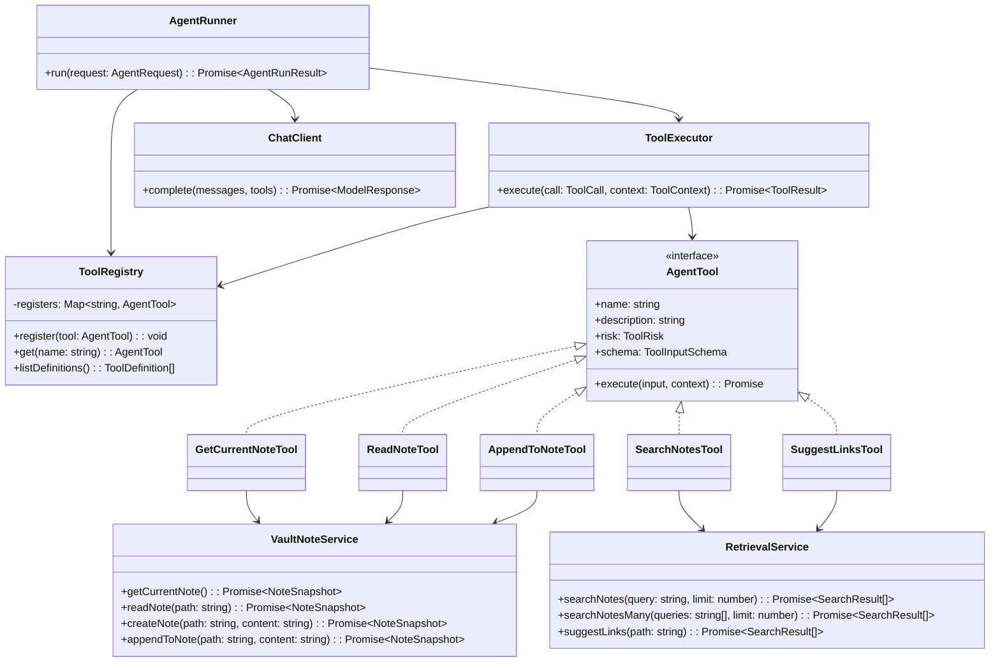
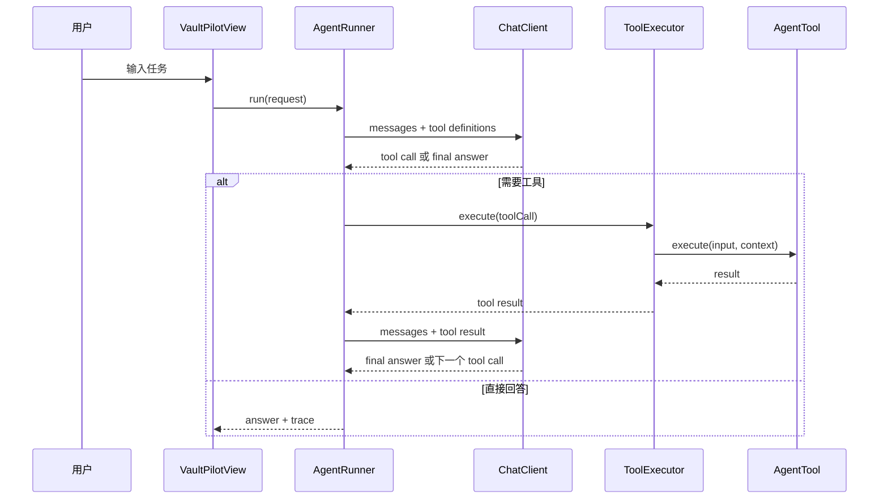

# VaultPilot Tool Calling 设计文档

这份文档用于梳理 VaultPilot 下一阶段的 Tool Calling 组件设计。目标不是一开始做一个很大的 Agent 框架，而是先建立清晰的对象边界、调用流程和安全边界。

当前 VaultPilot 已经有比较完整的 RAG 问答链路：

```text
用户问题 -> 查询改写 -> 多路检索 -> 混合排序 -> 回答和来源展示
```

Tool Calling 阶段要把它扩展为：

```text
用户任务 -> AgentRunner -> 模型选择工具 -> 插件执行工具 -> 模型观察结果 -> 继续调用工具或生成最终回答
```

## 设计目标

第一版 Tool Calling 只需要证明三件事：

1. 模型可以根据用户任务选择工具。
2. 插件可以验证参数、执行工具、返回结构化结果。
3. UI 可以展示工具调用过程，而不是把工具调用隐藏起来。

暂时不要急着做长期记忆、复杂工作流 DSL 或自动写回。先把工具调用闭环跑通。

## 推荐设计模式

### Command Pattern

每个工具都可以看成一个命令对象。它包含工具名、描述、输入 schema、风险等级和执行逻辑。

```ts
interface AgentTool<TInput, TOutput> {
	name: string;
	description: string;
	risk: ToolRisk;
	schema: ToolInputSchema;
	execute(input: TInput, context: ToolContext): Promise<TOutput>;
}
```

这很适合 Tool Calling，因为模型输出的是一个结构化 action：

```text
调用哪个工具
传入什么参数
等待系统执行
观察工具结果
```

也就是说，模型负责决策，工具对象负责执行，插件负责安全控制。

### Registry

`ToolRegistry` 是工具注册表，负责管理所有可用工具。

它的职责包括：

- 注册工具。
- 根据工具名找到工具实例。
- 生成模型可见的工具定义。
- 未来按风险等级或模式过滤工具。

示例：

```ts
class ToolRegistry {
	register(tool: AgentTool<unknown, unknown>): void;
	get(name: string): AgentTool<unknown, unknown> | undefined;
	listDefinitions(): ToolDefinition[];
}
```

### Adapter / Facade

工具不要直接到处调用 Obsidian API 或 RAG 内部类。建议包一层服务对象：

- `VaultNoteService`：当前笔记、读取笔记、新建笔记、追加内容。
- `RetrievalService`：搜索笔记、多路搜索、推荐链接。

这样工具本身会更干净：

```text
SearchNotesTool -> RetrievalService.searchNotes()
AppendToNoteTool -> VaultNoteService.appendToNote()
```

这样做的好处是：

- 工具类职责单一。
- 以后更容易测试。
- Obsidian API 的细节不会污染 Agent 层。
- 以后如果加入 MCP 或后端服务，也更容易替换实现。

### Query Rewrite Placement

V1 不把 query rewrite 做成单独的工具，也不让 `search_notes` 在内部默认再调用一次 AI rewrite。

原因是当前 rewrite 本身依赖模型。如果先单独请求模型 rewrite，再请求模型决定 tool call，会增加一次模型调用，也会降低同一轮对话的缓存命中率。

V1 的推荐边界是：

```text
用户问题
-> AgentRunner 请求模型
-> 模型在同一次响应中决定调用 search_notes，并生成 retrieval-ready query / queries
-> search_notes 只执行确定性的 RAG 检索、排序和结果格式化
-> 模型观察 tool result 后生成最终回答
```

也就是说，rewrite 能力迁移到 tool call 参数生成中：

```json
{
  "query": "VaultPilot tool calling design",
  "queries": [
    "VaultPilot tool calling design",
    "RAG as search_notes tool",
    "query rewrite placement tool calling"
  ],
  "limit": 5
}
```

`search_notes` 内部可以做基础参数规范化、去重、limit 限制和 fallback，但不主动发起第二次 AI rewrite。

如果 provider 不支持 tool calling，或 tool calling 请求失败，再回退到现有固定 RAG 链路：

```text
AI/rule-based rewrite -> searchMany -> answer
```

### Pipeline First, State Machine Later

第一版建议用简单的 bounded loop，不要马上上复杂状态机。

基本流程：

```text
请求模型
-> 模型返回工具调用
-> 执行工具
-> 把工具结果加入消息
-> 再请求模型
-> 得到最终回答或下一个工具调用
```

伪代码：

```ts
for (let step = 0; step < maxSteps; step += 1) {
	const response = await chatClient.complete(messages, tools);
	if (response.toolCalls.length === 0) {
		return response.finalAnswer;
	}
	const results = await toolExecutor.executeAll(response.toolCalls, context);
	messages.push(...results);
}
```

等以后出现这些需求，再升级成状态机：

- 写入前需要用户确认。
- 工作流需要暂停和恢复。
- 多个工具调用之间有复杂分支。
- 某些步骤失败后需要补救策略。

## 核心类图



## 第一批工具

### `get_current_note`

风险等级：`read`

用途：读取当前打开的 Markdown 笔记，让 Agent 知道用户正在处理什么。

输入：

```json
{}
```

输出：

```json
{
  "path": "notes/example.md",
  "basename": "example",
  "content": "...",
  "headings": ["..."],
  "links": ["..."]
}
```

### `read_note`

风险等级：`read`

用途：根据路径读取某篇笔记。通常用于 `search_notes` 找到候选来源之后进一步读取。

输入：

```json
{
  "path": "notes/example.md"
}
```

### `search_notes`

风险等级：`read`

用途：把现有 RAG 检索链路包装成模型可调用的工具。

输入：

```json
{
  "query": "tool calling design",
  "queries": [
    "tool calling design",
    "VaultPilot RAG tool",
    "Obsidian agent tool calling"
  ],
  "limit": 5
}
```

输出应该包含：

- 笔记路径。
- 标题。
- 分数。
- 摘录。
- 所在标题层级。
- 行号范围。

### `suggest_links`

风险等级：`read`

用途：为当前笔记或指定笔记推荐相关链接。

输入：

```json
{
  "path": "notes/example.md"
}
```

### `append_to_note`

风险等级：`write`

用途：向某篇笔记追加内容。

第一版不要直接写入。它应该先返回一个 proposed edit，由 UI 展示 preview 或 diff，用户确认后再真正写入。

输入：

```json
{
  "path": "notes/example.md",
  "content": "## Summary\n..."
}
```

## 调用流程



## 写入安全边界

读取类工具可以直接执行。

写入类工具必须采用两阶段：

```text
propose edit -> show preview/diff -> user confirms -> apply edit
```

建议风险等级：

```ts
type ToolRisk = 'read' | 'write' | 'dangerous';
```

第一版不要做 `dangerous` 工具，例如：

- 删除笔记。
- 重命名笔记。
- 批量替换。
- 整个文件夹级别的重写。

## 建议目录结构

完整版本：

```text
src/agent/
  agent-runner.ts
  tool-executor.ts
  tool-registry.ts
  types.ts

src/agent/tools/
  get-current-note-tool.ts
  read-note-tool.ts
  search-notes-tool.ts
  suggest-links-tool.ts
  append-to-note-tool.ts

src/services/
  vault-note-service.ts
  retrieval-service.ts
```

如果第一版觉得文件太多，可以先简化：

```text
src/agent/types.ts
src/agent/tool-registry.ts
src/agent/tool-executor.ts
src/agent/tools.ts
src/agent/agent-runner.ts
```

等边界稳定以后再拆分文件。

## V1 范围

第一版只需要做出这个闭环：

```text
用户提出任务
-> 模型调用 search_notes 或 get_current_note
-> 工具结果显示在 trace 中
-> 模型基于工具结果回答
```

然后再加：

```text
append_to_note proposal
-> preview
-> confirm
-> write
```

## 暂时不要做什么

- 长期记忆。
- 自动写回，没有确认。
- 删除、重命名、批量改写工具。
- 复杂图编排。
- 大型 workflow DSL。

先把基础 Command loop 做稳，再把它升级成工作流。
